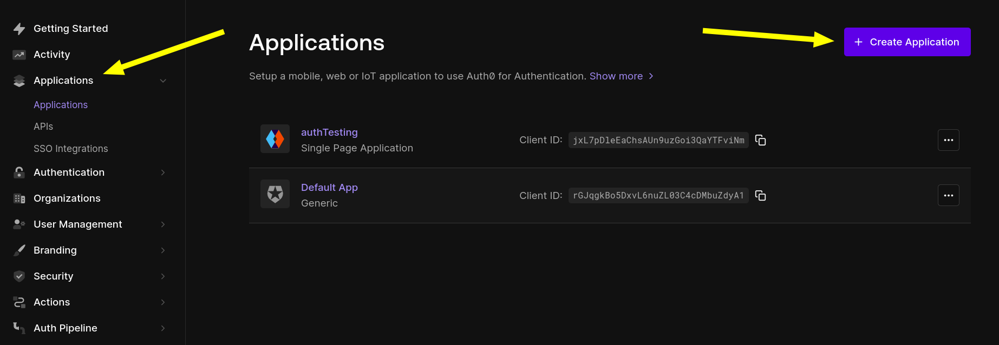
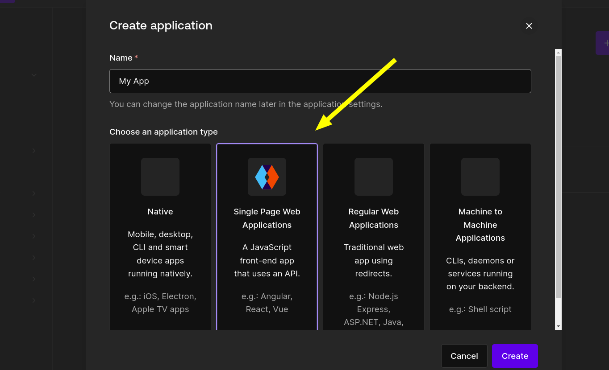
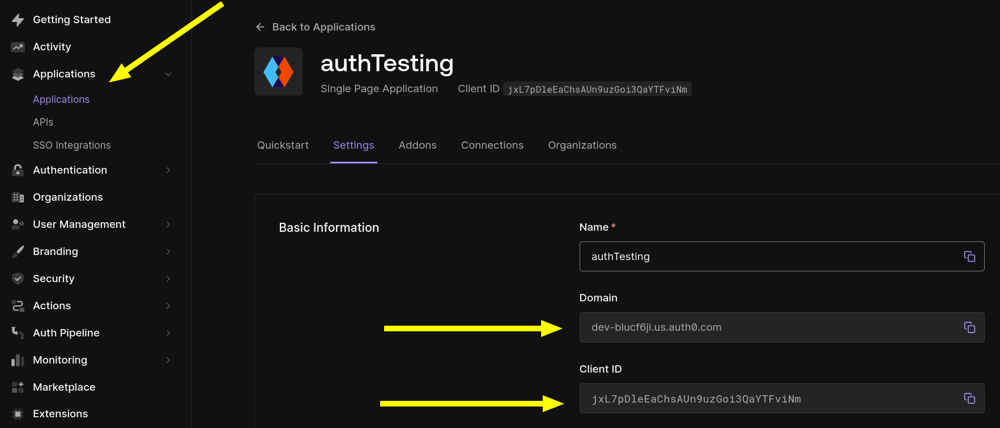
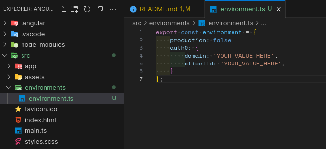

# CMSY

CMSY is a self-hosted tempalte that could use to kickstart your project and shorten the time-to-market variable.  

- [CMSY](#cmsy)
  - [Technical environment](#technical-environment)
  - [Usage](#usage)
    - [Auth0 set up](#auth0-set-up)
    - [Application set up](#application-set-up)

## Technical environment

This project uses the following tehcnologies and services:

Front end

- Angular
- Daisy UI
- Tailwind CSS
- Bootstrap icons

Back end

- Nest JS
- TypeORM
- MySQL

Third-party services

- Auth0
- imageKit

## Usage

To use this template, you will need to set up few thins first.

### Auth0 set up

Make sure to head over to Auth0's official website and create an account.
Once you're logged in, head ovcer to `Applicattions` and created a new one.

`⚠️ Note: The application type must be SPA ⚠️`

### Application set up

Now that the Auth0 app has been created, your SPA (this project) should be able to point at that specific instance using a combination of clientID and domain strings.  

1. Go to Auth0 dashboard, Applications
2. Select your SPA application
3. Copy the domain string along with the clientID

Make sure to update the `src/environment/**.ts` files to include those 2 values.

